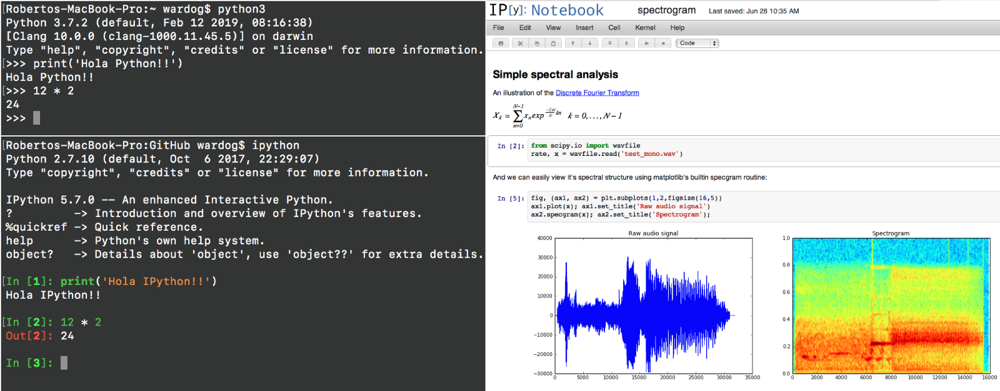
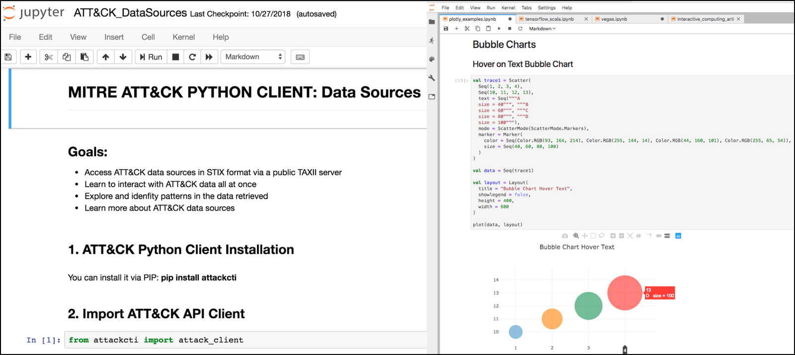

Jupyter Notebook
================

The Jupyter Notebook is an open-source web application that allows you to create and share documents that contain live code, equations, visualizations and narrative text.
Uses include: data cleaning and transformation, numerical simulation, statistical modeling, data visualization, machine learning, and much more.

The Jupyter Notebook project is the evolution of the IPython Notebook library which was developed primarily to enhance the default python interactive console by enabling scientific operations and advanced data analytics capabilities via sharable web documents.

Nowadays, the Jupyter Notebook project not only supports Python but also over 40 programming languages such as R, Julia, Scala and PySpark.
In fact, its name was originally derived from three programming languages: Julia, Python and R which made it one of the first language-agnostic notebook applications, and now considered one of the most preferred environments for data scientists and engineers in the community to explore and analyze data.

How do Jupyter Notebooks Work?
##############################

Jupyter Notebooks work with what is called a two-process model based on a kernel-client infrastructure.
This model applies a similar concept to the `Read-Evaluate-Print Loop (REPL) <https://en.wikipedia.org/wiki/Read%E2%80%93eval%E2%80%93print_loop>`_ programming environment that takes a single user's inputs, evaluates them, and returns the result to the user.

.. image:: _static/jupyter-design.png
    :alt: Jupyter Design
    :scale: 70%

Based on the two-process model concept, we can explain the main components of Jupyter the following way:

Jupyter Client
**************

* It allows a user to send code to the kernel and it could be in a form of a `Qt Console <https://github.com/jupyter/qtconsole>`_ or a browser via notebook documents.
* From a REPL perspective, the client does the read and print operations.
* Notebooks are hosted by the Jupyter web server which uses Tornado to serve HTTP requests.

Jupyter Kernel
**************

* It receives the code sent by the client, executes it, and returns the results back to the client for display. A kernel process can have multiple clients communicating with it which is why this model is also referred as the decoupled two-process model.
* From a REPL perspective, the kernel does the evaluate operation.
* kernel and clients communicate via an interactive computing protocol based on an asynchronous messaging library named `ZeroMQ <http://zeromq.org/>`_ (low-level transport layer) and WebSockets (TCP-based)

Jupyter Notebook Document
*************************

* Notebooks are automatically saved and stored on disk in the open source JavaScript Object Notation (JSON) format and with a .ipynb extension.

Jupyter Kernels Available
#########################

IPython Kernel (Python)
*************************

The Jupyter team maintains the `IPython kernel <https://github.com/ipython/ipython>`_ since the Jupyter notebook server depends on the IPython kernel functionality.
Many other languages, in addition to Python, may be used in the notebook.

PySpark Kernel (Python)
************************

A python Kernel to enable `Apache Spark for python <http://spark.apache.org/docs/latest/api/python/index.html>`_.
Writing PySpark Applications is really no different than writing normal Python applications or packages.
It’s quite similar to writing command-line applications in particular.
Spark doesn’t have a build concept, just Python scripts, so to run an application, you simply execute the script against the cluster. 

Syplon Kernel (Scala/Python)
*****************************

A Scala kernel for Apache Spark that uses `metakernel <https://github.com/Calysto/metakernel>`_ in combination with `py4j <https://www.py4j.org/>`_.

R Kernel (R)
************

An R kernel for `Apache SparkR <http://spark.apache.org/docs/latest/sparkr.html#sparkr-r-on-spark>`_.
SparkR is an R package that provides a light-weight frontend to use Apache Spark from R.
In Spark 2.4.1, SparkR provides a distributed data frame implementation that supports operations like selection, filtering, aggregation etc. (similar to R data frames, dplyr) but on large datasets.
SparkR also supports distributed machine learning using MLlib.

Jupyter Notebooks Server
########################

.. toctree::
   :maxdepth: 2
   
   Jupyter Hunt <jupyter_hunt>
   Jupyter RTO <jupyter_rto>